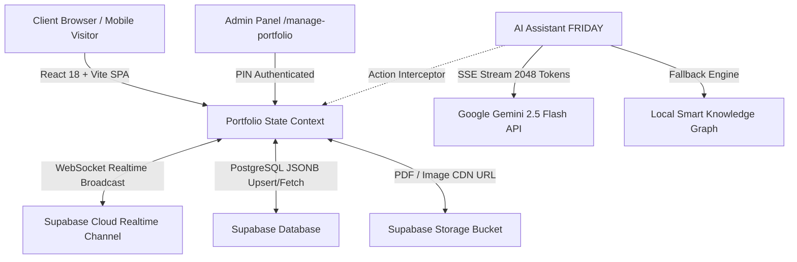

<div align="center">

# ⚡ AI-Powered Developer Portfolio & CMS

[](https://khustar-portfolio.vercel.app/)
[](https://react.dev/)
[](https://vitejs.dev/)
[](https://supabase.com/)
[](https://ai.google.dev/)
[](https://tailwindcss.com/)

<p align="center">
  <b>A state-of-the-art, full-stack reactive developer portfolio engineered for Khustar Hussain.</b><br/>
  Featuring real-time multi-device Supabase cloud sync, Google Gemini 2.5 Flash streaming AI assistant (FRIDAY), PIN-protected CMS control panel, custom resume PDF cloud storage, and glassmorphic UI.
</p>

[Explore Features](#-key-features) • [Architecture](#-system-architecture) • [AI Integration](#-ai-assistant-friday-engineering) • [Getting Started](#-getting-started) • [Deployment](#-deployment-guide)

---

</div>

## 🌟 Key Features

### 🤖 1. FRIDAY — Embedded Gemini 2.5 Flash AI Assistant
- **SSE Real-Time Streaming**: Token-by-token response streaming using Native `ReadableStream` & SSE for 0 latency perceived response.
- **Deep Multi-Turn Context Memory**: Retains 30 conversational turns with persistent browser session memory.
- **Strict Portfolio-Oriented Guardrails**: Accurately explains Khustar's skills, projects, and architecture; rejects off-topic queries gracefully.
- **Autonomous Admin Command Interceptor**: In Admin mode, converts natural language instructions into portfolio actions (`[ACTION: updateProject]`, `[ACTION: addSkill]`).
- **Offline Smart Knowledge Fallback**: Seamless fallback engine when API keys are unconfigured or offline.

### ⚡ 2. 3-Layer Real-Time Multi-Device Synchronization
- **Supabase WebSocket Broadcast**: Instant zero-reload state updates across all visitor devices worldwide without database locks.
- **PostgreSQL Database Storage**: Persistent storage in Supabase PostgreSQL JSONB payload.
- **Tab Visibility & Focus Heartbeat**: Automatic silent hydration when a user switches tabs or wakes up mobile devices.
- **Local Multi-Tab Sync**: Zero-ms instant sync between tabs on the same device using `BroadcastChannel`.

### 🎛️ 3. Full-Featured PIN-Protected CMS Admin Panel (`/manage-portfolio`)
- **Profile & Bio Manager**: Real-time editor for titles, bio, location, contact, and experience.
- **Project Case Study Manager**: Add, edit, reorder, or delete projects with live tags, GitHub URLs, problem statements, and solutions.
- **Skills & Tech Stack Manager**: Categorized skill management with instant updates.
- **Certificates & Education Timelines**: Manage credential URLs, skills learned, institutions, and dates.
- **Custom Resume PDF Cloud Storage**: Upload custom `.pdf` files directly to Supabase Storage bucket with cache-busting CDN links (replaces obsolete generator scripts).
- **JSON Backup & Restore**: One-click full portfolio backup export and import.

### 🎨 4. Ultra-Smooth Glassmorphic UI/UX
- **Modern Glassmorphism**: Tailored backdrop filters, subtle glowing gradients, and dynamic light/dark mode toggles.
- **Snappy Micro-Animations**: Hardware-accelerated GPU transitions (`cubic-bezier(0.16, 1, 0.3, 1)`) for buttery-smooth modal entrances and section navigation.
- **100% Responsive Design**: Pixel-perfect on 4K desktops, laptops, tablets, and mobile screens.

---

## 🏗️ System Architecture



---

## 🧠 AI Assistant (FRIDAY) Engineering

### Technical Highlights
1. **Streaming Protocol**: Implements `https://generativelanguage.googleapis.com/v1beta/models/gemini-2.5-flash:streamGenerateContent?alt=sse` with `TextDecoder` and chunk buffer processing.
2. **Context Window Management**: Structures multi-turn conversation arrays ensuring strictly alternating `user` and `model` role turns.
3. **Structured System Instruction**: Injects live portfolio snapshot (projects, skills, certs) as grounded ground truth to prevent hallucinations.
4. **Tool Execution Grammar**:
   ```json
   [ACTION: updatePersonalInfo] { "name": "Khustar Hussain", "bio": "..." } [/ACTION]
   ```
   Parsed via regex and executed against context state mutators.

---

## 🚀 Tech Stack

| Domain | Technology |
| :--- | :--- |
| **Frontend Framework** | React 18 (SPA with React Router v7) |
| **Build Tool & Bundler** | Vite 6 |
| **Styling & Icons** | Vanilla CSS, Tailwind CSS v4, Lucide React |
| **Backend & Cloud Database** | Supabase (PostgreSQL, JSONB, Storage) |
| **Realtime Engine** | Supabase Realtime WebSockets & Broadcast Channels |
| **AI LLM Engine** | Google Gemini 2.5 Flash / Gemini 2.0 Flash |
| **Deployment & Hosting** | Vercel (CI/CD Git integration with SPA Rewrites) |

---

## 📦 Getting Started

### 1. Clone the Repository
```bash
git clone https://github.com/Khustar04/AI-Based-Portfolio.git
cd AI-Based-Portfolio
```

### 2. Install Dependencies
```bash
npm install
```

### 3. Configure Environment Variables
Create a `.env` file in the root directory:
```env
# Google Gemini AI Key
VITE_GEMINI_API_KEY=your_gemini_api_key_here

# Supabase Credentials
VITE_SUPABASE_URL=https://your-project.supabase.co
VITE_SUPABASE_ANON_KEY=your_supabase_anon_key_here

# Optional Contact Form Sheet URL
VITE_GOOGLE_SHEET_URL=your_google_apps_script_url_here
```

### 4. Run Locally
```bash
npm run dev
```

---

## 🚢 Deployment Guide

### Vercel Deployment
1. Import repository into [Vercel](https://vercel.com).
2. Add Environment Variables (`VITE_SUPABASE_URL`, `VITE_SUPABASE_ANON_KEY`, `VITE_GEMINI_API_KEY`, `VITE_GOOGLE_SHEET_URL`).
3. Deploy! The `vercel.json` rewrite file handles SPA sub-routing automatically.

---

## 📄 License
This project is open source and available under the [MIT License](LICENSE).

<div align="center">
  <b>Designed & Engineered with ❤️ by <a href="https://github.com/Khustar04">Khustar Hussain</a></b>
</div>
